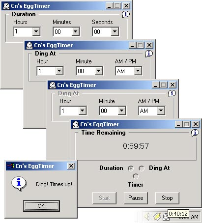



## EggTimer \- A General Use Timer Utility \(Update 2\)

### Description

I was sitting at my computer today in a programming quandary when my fiancé asked me to let her know when it was 1:15pm. Since she does this quite often and I needed a distraction from my current task, I decided to build this little application – EggTimer. EggTimer allows you to set a duration (i.e. - 30min), a specific time (i.e. - 1:15pm) or it can be used as an upward counting timer (like a stopwatch). Once you start EggTimer, it minimizes itself into the system tray where it can be accessed to check the time remaining, reset/change the time, or pause/resume/stop the timer. You can also see the time remaining/running time by floating over the tray icon. When the timer expires, a ‘vbSystemModal’ message box is popped above your working app to let you know the time is up. This little application is really handy if you sometimes need a reminder of the time when you’re working on the computer =) This code utilizes a simple class I created from a number of examples from around the web that encapsulates the API functions used in placing an icon in the system tray. This class is definitely something to look it if you’re interested in placing an icon in the system tray. *LATEST UPDATE* It seems that I had a little issue with the time math in certain situations (it was adding an extra minute). When I get a chance I’m going to overhaul that little but complicated portion of the code. Enjoy, if you like it please remember to vote! If you find a bug, please let me know!
 
### More Info
 

             |
---                |---
**Submitted On**   |2002-08-26 12:35:08
**By**             |[Nick Campbeln](https://github.com/Planet-Source-Code/PSCIndex/blob/master/ByAuthor/nick-campbeln.md)
**Level**          |Beginner
**User Rating**    |5.0 (50 globes from 10 users)
**Compatibility**  |VB 5\.0, VB 6\.0
**Category**       |[Complete Applications](https://github.com/Planet-Source-Code/PSCIndex/blob/master/ByCategory/complete-applications__1-27.md)
**World**          |[Visual Basic](https://github.com/Planet-Source-Code/PSCIndex/blob/master/ByWorld/visual-basic.md)
**Archive File**   |[EggTimer\_\-1227668262002\.zip](https://github.com/Planet-Source-Code/nick-campbeln-eggtimer-a-general-use-timer-utility-update-2__1-34028/archive/master.zip)

